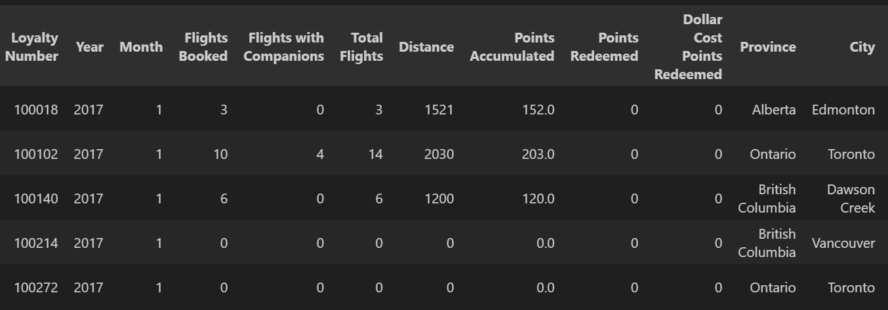
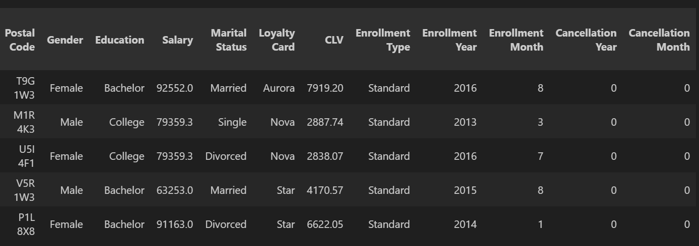
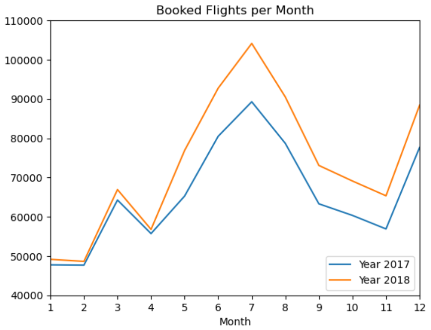
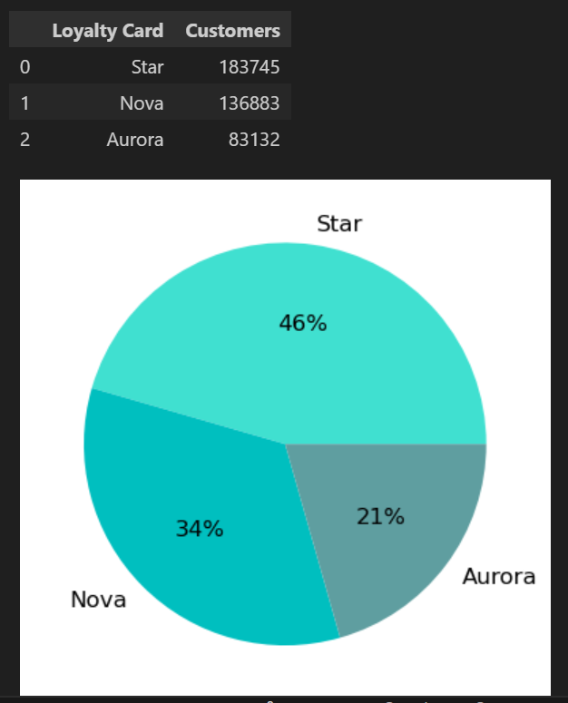

# ✈️ ANÁLISIS DE DATOS 
## Comportamiento de los clientes de una aerolínea

> Ejercicio académico - Data Analytics  
> Módulo 03 - Promo 54  
> Fecha: Septiembre 2025  

### 📊 DATOS A ANALIZAR
Los datos con los que se trabaja consisten en dos archivos '.cvs' que, en conjunto, describen el **comportamiento de los clientes** dentro de un programa de lealtad de una **aerolínea**.
-   `Customer Flight Activity`.csv  
Este archivo contiene información sobre la actividad de vuelo de los clientes, incluyendo el número de vuelos reservados, la distancia volada, puntos acumulados y redimidos, y costos asociados a los puntos redimidos.
-   `Customer Loyalty History`.csv  
Este archivo proporciona un perfil detallado de los clientes, incluyendo su ubicación, nivel educativo, ingresos, estado civil, y detalles sobre su membresía en el programa de lealtad (como el tipo de tarjeta, valor de vida del cliente, y fechas de inscripción y cancelación).


### 🧩 ESTRUCTURA DEL REPOSITORIO

```
📝 EJERCICIO TÉCNICO
│
├── 📁 data
│    ├── Customer Flight Activity.csv
│    ├── Customer Loyal History.csv
│    └── Customers.csv  (archivo final de trabajo)
│
├── 📁 images 
│    ├── df_01.csv
│    ├── df_02.csv
│    ├── gr_01.csv
│    └── gr_02.ipynb
│
├── 📁 notebooks
│    └── mod03_ej_tecnico.ipynb
│
├── .gitignore
│
├── requirements.txt
│
└── README.md
```

### 🔧 TECNOLOGÍAS USADAS
- Python 3
- Librerías: 
    - Pandas
    - Numpy
    - SImpleImputer de sklearn
    - IterativeImputer de sklearn
    - KNNImputer de sklearn
    - Seaborn
    - Matplotlib
- Git & GitHub


### 📝 NOTEBOOK DE ANÁLISIS
#### > INDICE 
--> Visualización Inicial  

--> Análisis Descriptivo  

--> Limpieza 

-   Valores Duplicados  
-   Valores Nulos  

--> Unión de Datos  

--> Análisis y Visualización  

1. ¿Cómo se distribuye la cantidad de vuelos reservados por mes durante el año?  
2. ¿Existe una relación entre la distancia de los vuelos y los puntos acumulados por los clientes?  
3. ¿Cuál es la distribución de los clientes por provincia o estado?  
4. ¿Cómo se compara el salario promedio entre los diferentes niveles educativos de los clientes?  
5. ¿Cuál es la proporción de clientes con diferentes tipos de tarjetas de fidelidad?  
6. ¿Cómo se distribuyen los clientes según su estado civil y género?

#### > PREVISUALIZACIÓN 
Datos finales del archivo





Gráficos de análisis

  



### 🚀 Cómo Ejecutar el Proyecto
1. Clonar el repositorio:  
git clone https://github.com/usuario/proyecto.git  
cd proyecto
2. Instalar dependencias:  
pip install -r requirements.txt
3. Abrir el notebook en VSCode, Jupyter Lab/Notebook o Jupyter Web:  
mod03_ej_tecnico.ipynb


### 🧠 CREADORAS  
- Ana Robles García (https://github.com/AnaROGA) 

### ✅ Estado del Proyecto

Finalizado.
Mejoras en proceso.